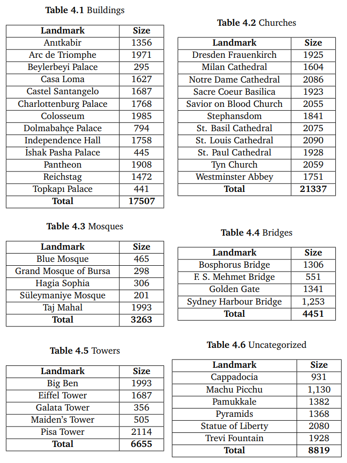
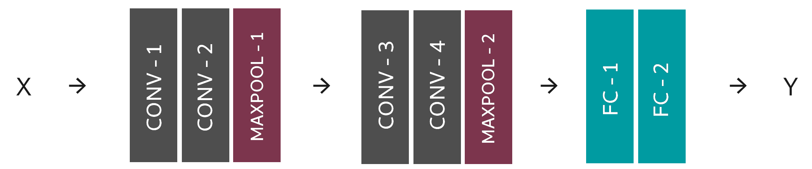
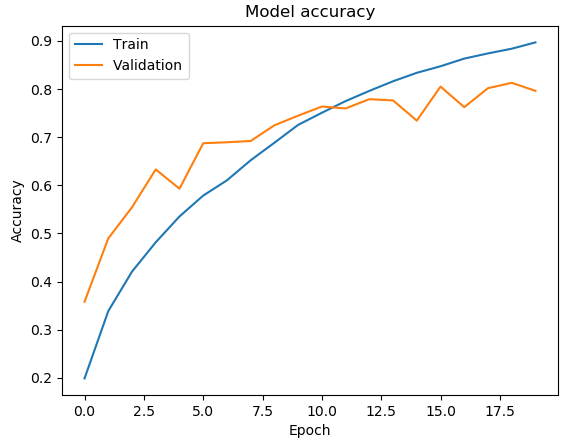
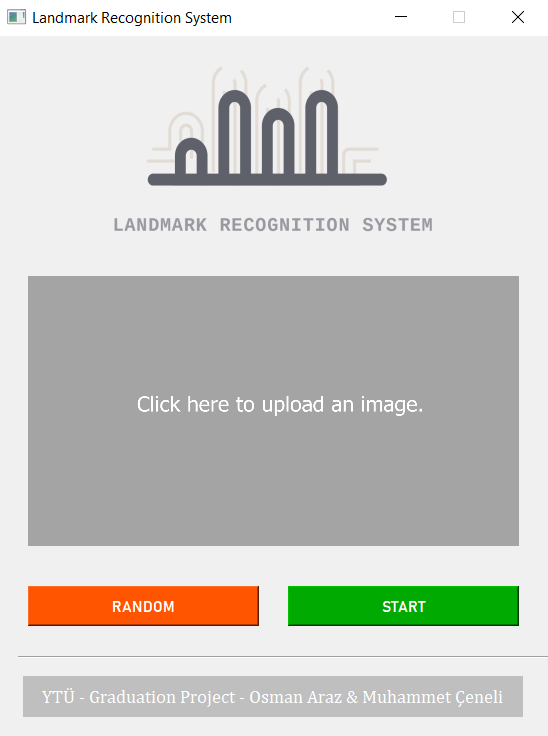
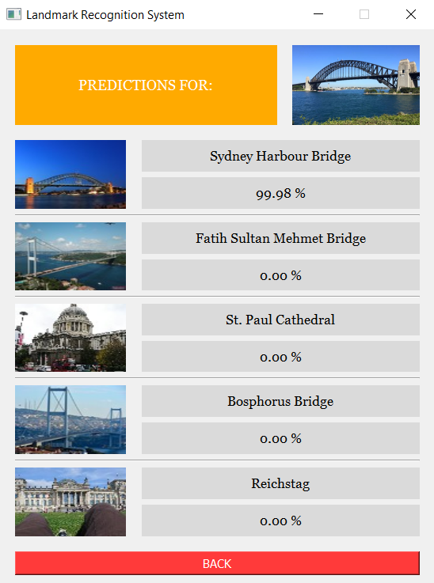

# Landmark Recognition System
A landmark recognition system that detects famous landmarks on images. The system uses convolutional neural networks. Contributions made by Osman Araz and Muhammet Çeneli, respect to their 2nd graduation project of Yıdız Technical University - Computer Engineering department.

## Model Training
The dataset collected and trained with a CNN model.

### Dataset
The dataset contains about 62.000 images over 44 classes. Each class has a construction type; such as tower, bridge, church, mosque etc. Details of the dataset are given below.

  

### CNN Model
The CNN model have four convolution layers followed by two dense layers. There are also some pooling, normalization, regularization and activation layers in the model. Details can be observed on the code.

  

### Training
The dataset split into 85% for train and 15% for test set. Also, 15% part of the train set used for validation. After 20 epochs with 32 batch size, the model achived to 92.66% train accuracy and 79.03% test accuracy. The accuracy history of the model over epochs is given below.

  

## GUI
PyQT used to create the graphical user interface for this system. 

### Screenshots
- Main Page:

  

- Results Page:

  

## Installation
To run or modify this project, you need to have Python 3.7 on your computer. Also, you need to install these libraries: tensorflow, keras, numpy, Pillow, os, logging (You can install these with "pip install library-name").

### Execution of Model Training Script
To execute the model training script, go to "Model Training" folder in your terminal screen and type "python keras_cnn.py" and hit the enter key.

### Execution of GUI
To run the GUI, you need to have PyQt5 library on your computer. To install it, type and enter "pip install PyQt5" in your terminal screen. After that, go to "PyQt Project" folder in your terminal screen and type "python main.py" and hit the enter key.
